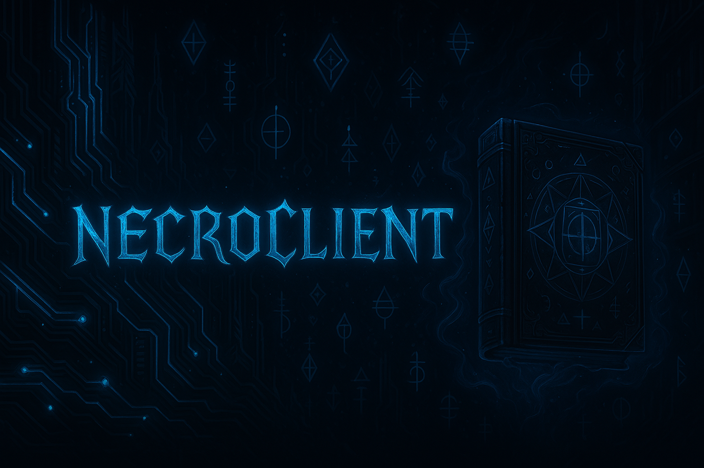

<h1 align="center">🧙‍♀️ Valariya</h1>
<p align="center">
  <i><b>"Kod bir araç değil, bir tapınaktır."</b></i><br>
  🧠 Software Architect · 🛠️ Reverse Engineer · ⚔️ Creator of the Necronomicon
</p> 

> Sistem mimarileri, şifrelenmiş modüller, lisans tabanlı yapılar ve .NET dünyasında tapınak gibi inşa edilen kod sistemleri.

---

## 🔮 Hakkımda

- 🔭 Şu anda [NecronomiconLauncher](https://github.com/Valariya/NecronomiconLauncher) üzerinde çalışıyorum
- 🌱 .NET, C#, WPF, AES-GCM, Socket API ve güvenlik sistemleri üzerine yoğunlaştım
- 🧠 "Kod sadece araç değil, bir tapınaktır" felsefesini benimsiyorum
- 🎮 Özellikle **Unturned** gibi oyunlarda modül geliştiriciliği yapıyorum
- ⚙️ Kendime ait özel .grim modül sistemleri oluşturuyorum
- 🌐 Yakında `necroclient.dev` yayında olacak

```yaml
username: valariya
yetki: Kod büyücüsü
uzmanlık:
  - .NET WPF launcher sistemleri
  - AES-GCM şifreleme ve inject mekanizmaları
  - C# grim module mimarisi
  - GitHub yönetimi ve yapı tasarımı
  - Anti-cheat analiz ve karşı atak sistemleri
```
---

## 🧩 Projelerim

| Proje | Açıklama |
|-------|----------|
| [NecronomiconLauncher](https://github.com/Valariya/NecronomiconLauncher) | Modüler, lisanslı, şifreli WPF tabanlı launcher sistemi |
| Nocturned Module | AES-GCM şifreli, inject edilebilir dinamik .dll sistemi |
| BypassX | Anti-anticheat bypass mimarisi (yolda) |

---

## 🧩 Tapınaktaki Projeler

- 🔥 [**NecronomiconLauncher**](https://github.com/Valariya/NecronomiconLauncher) – Şifreli modül sistemi, HWID doğrulama ve grim yükleyici
- 🛡️ **BypassX** – Anticheat gözlem & koruma modülü (modüler .grim yapı)
- 🧛 **Nocturned** – Unturned için özel geliştirilmiş büyüsel injection modülü
- 🧙‍♂️ **EgguWare Legacy** – Küllerden doğan bilgi kaynağı

---

## ✨ Teknolojiler


---

## 📫 Bana Ulaş

- 📧 valariya@necroclient.dev
- 🌐 [LinkedIn](https://www.linkedin.com/in/kerem-alkan/)

---

## 📜 Söz

> "Bilgeliği arayan her kod, karanlık bir kapıyı aralar. Bu kapıdan geçen, sıradan biri olarak dönemez."



---

## 📊 GitHub İstatistikleri

<p align="center">
  
  
</p>

---

## 🧙‍♀️ Sözüm

> Kodun gittiği yer kadar güçlüdür onun büyücüsü.
